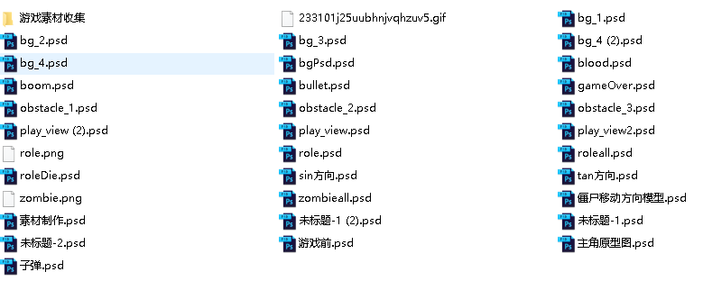
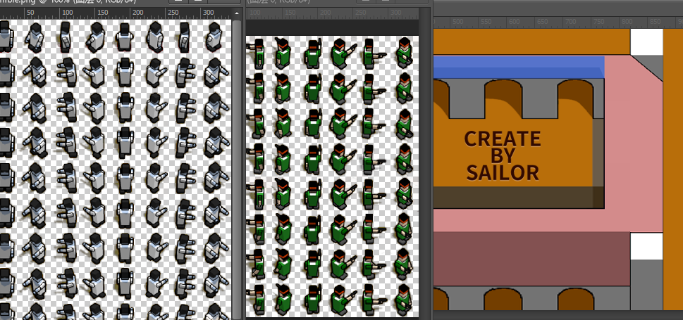
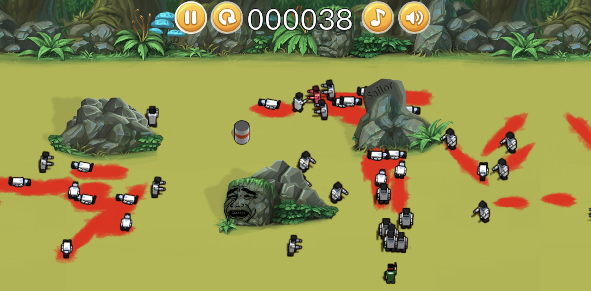
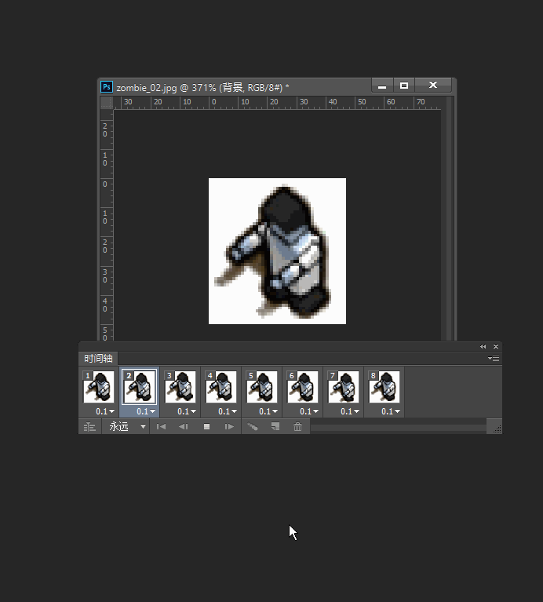
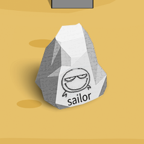
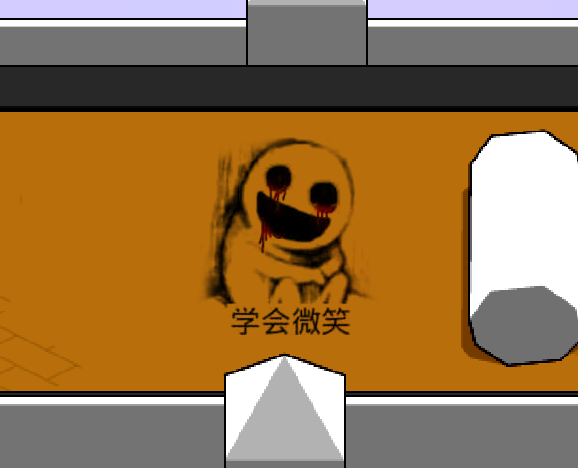
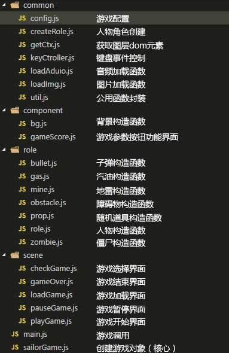
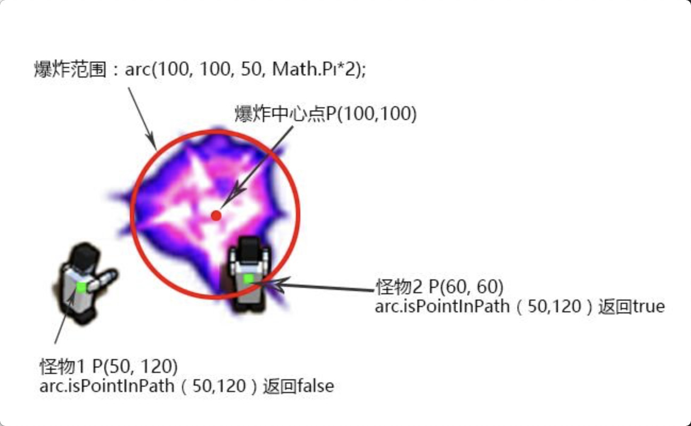
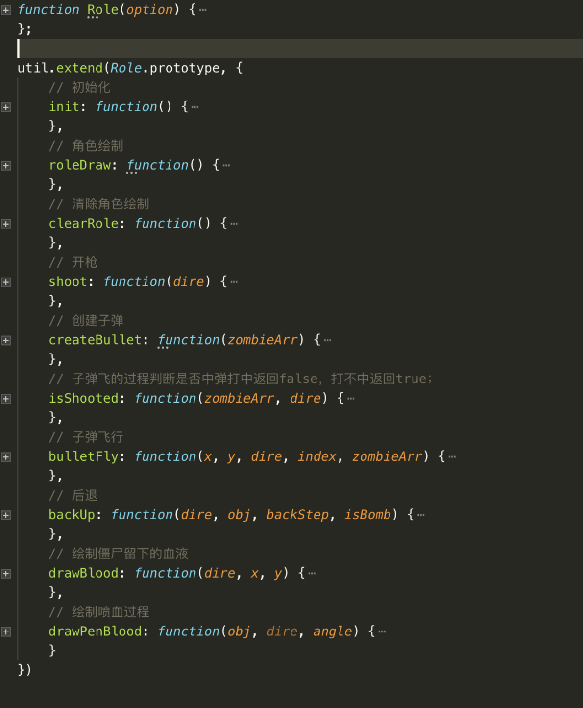
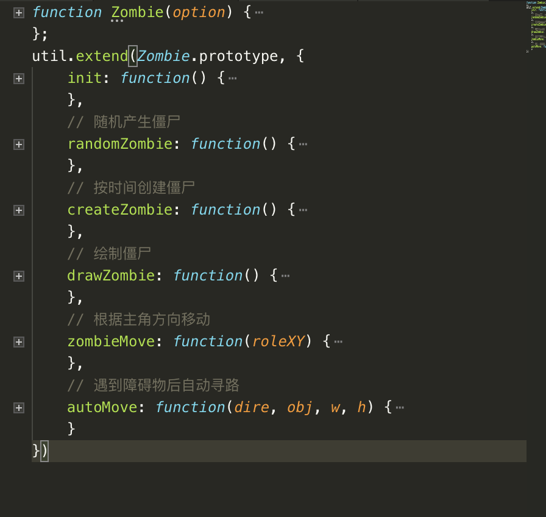

# zombie
## 点击进入游戏：https://lxjsoilor.github.io/zombie/index.html
 <br/>
* 游戏绘制：基于原生H5 canvas绘制。
* 碰撞检测：人物、怪物、子弹、道具拾取的碰撞基于canvas内部实现的isPointInPath()实现。
* 游戏引擎：自己编写的简易游戏引擎，实现了游戏循环、暂停、动画、行为、声音与图片预加载、向量与碰撞检测系统。
* 游戏仅支持pc端
* 玩的开心~


# canvas 和 游戏开发
> 之前有段时间，学习了canvas。发现这个H5的新标签还是很有意思的。canvas是HTML5新增的组件，它就像一块幕布，可以用JavaScript在上面绘制各种图表、动画、游戏等。</br>
去年微信小游戏很火，有时自己也想去学下开发游戏的知识，游戏的开发离不开游戏引擎，比如比较火的有egret和cocos creator。但是我毕竟不是专业的游戏开发，游戏引擎就不用了，就单纯使用原生js加html5的canvas来搞一搞游戏。<br/>

>于是花了一段时间断断续续开始开发，从搜集素材（花瓣网），UI原型制作，PS场景合成，游戏主角，怪物精灵表制作，到收集音乐音效。开始开发到最终完成：

* 作品地址：https://lxjsoilor.github.io/zombie/index.html
* 源码地址：https://github.com/lxjsoilor/zombie
* 有兴趣的同学可以打开看看。

### 部分游戏截图：
* 游戏原型的设计文件<br/>

* 游戏主角怪物精灵表以及场景<br/>

* 加载页面

* 关卡选择(可以选择单人或者双人游戏)

* 部分场景



## 设计部分
<hr/>
* 人物的设计最复杂，包括太多的细节，行走姿势，行走方向，死亡姿势，死亡方向等等。毕竟不是专业的游戏UI设计师，也不会制作骨骼动画，所以这部分并非原创，而是参考了非常有名的游戏网站4399的《丧尸危机》人物原型。并通过Photoshop制作成一张张的精灵表：


动画就是通过切换显示每张精灵表的坐标和显示区域形成的，用Photoshop的时间轴模拟下：

然后我们就大概知道精灵表用来做啥的了。后面我们就要用代码实现这样的动画了。

* 场景的合成和设计，素材都是花瓣网找的，还有障碍物的设计，摆放的坐标我们需要记住，因为后面代码部分要做碰撞检测。最后放上我独一无二“水印”，比如：



* 最后是声音素材的收集，百度：游戏声音素材。然后慢慢挑选。。。。

## 代码部分
<hr/>

>整个程序实现了基本的游戏引擎，碰撞检测和追踪算法并且基于canvas绘制。<br/>
接下来见解围绕源码进行，有需要的同学可以下载源码瞧一瞧。

* 文件结构
    
    * index.html 入口文件。
    * images 文件夹用于存储游戏过程要用到图片。
    * sounds 文件夹用于存储游戏的音效
    * gulpfile.js 用于打包压缩的简单工具gulpfile.js
    * js文件夹比较复杂，因为模块化开发，很多功能都抽象成对象，存放着近20个js文件。简单介绍下：
        <br/>
        

* 游戏实现原理和游戏循环的实现
    * 我们都看过动画，我觉得游戏就是认为的操作着动画的播放。比如最简单的轮播图。所以我们的游戏引擎就是动画加上一堆的鼠标事件，键盘事件来告诉动画该怎么播放。原理就这么简单。
    * 具体到代码，循环执行最简单的就是写一个定时器（setInterval或requestAnimationFrame()）然后监听事件。定时器内去执行各个游戏元素的对象：比如人物，怪物和子弹的运行轨迹。除非游戏暂停，这个定时器会一直持续下去。如图：

        > 我这里让动画循环下去没有用到setInterval，而是用到了requestAnimationFrame()方法。这个方法接受一个函数作为参数，浏览器会在绘制的最佳时机调用这个函数。所以游戏能不能更流畅就跟你的电脑性能有关了。

    * 然后是动画循环的代码的实现：
    ```
        ...前面代码省略
        (function loop() {
            // 是否暂停游戏
            if (_this.isGameOver) {
                return;
            };
            if (!_this.isPause) {
                //判断是否双人
                // 人物绘制前清空图层
                _this.role.clearRole();
                // 绘制人物
                _this.role.init();
                // 重复执行人物移动函数
                _this.roleCtrl1.moveStep();
                // 绘制人物2
                _this.role2 ? _this.role2.init() : '';
                // 重复执行人物移动函数
                _this.role2 ? _this.roleCtrl2.moveStep() : '';
                // 重复绘制子弹
                // 获取僵尸数组传入创建创建子弹函数
                _this.role.createBullet(_this.zombie.zombieArr);
                _this.role2 ? _this.role2.createBullet(_this.zombie.zombieArr) : '';
                // 重复绘制僵尸
                // 获取人物坐标中心点
                if (_this.dobuleRole) {
                    _this.roleXY = {
                        role1: {
                            x: _this.role.roleCx + _this.role.roleW / 2,
                            y: _this.role.roleCy + _this.role.roleH / 2,
                            isDie: _this.role.isDie,
                        },
                        role2: {
                            x: _this.role2.roleCx + _this.role2.roleW / 2,
                            y: _this.role2.roleCy + _this.role2.roleH / 2,
                            isDie: _this.role2.isDie,
                        }
                    };
                } else {
                    _this.roleXY = {
                        role1: {
                            x: _this.role.roleCx + _this.role.roleW / 2,
                            y: _this.role.roleCy + _this.role.roleH / 2,
                            isDie: _this.role.isDie,
                        },
                    };
                }
                // 僵尸移动
                _this.zombie.zombieMove(_this.roleXY);
            };
            requestAnimationFrame(loop);
        })()
        后面代码省略...
    ```
    > 有了这个循环，我们游戏的框架就大体搭起来了，接下来只要把每一帧需要发生的事情写入到这个自执行函数，浏览器就自动帮我们运行了。

         


* canvas简单说明
    * 获取canvas<br/>
    要使用canvas绘制，首先获取到canvas实例，在H5获取canvas和获取其他标签一样，通过document获取。
        ```
        <!-- html -->
        <canvas id="bgCvs" width="1200" height="600"></canvas>
        <!-- JavaScript -->
        var roleCvs = document.getElementById('roleCvs');
        var ctxRole = roleCvs.getContext('2d');
        ```

    * 填充色和线条色
        ```
        var canvas = document.getElementById("myCanvas");
        var ctx = canvas.getContext("2d");
        ctx.fillStyle = "#0000ff";
        ctx.fillRect(20, 20, 150, 100);
        ```

    * 绘制矩形
        ```
        var canvas = document.getElementById("myCanvas");
        var ctx = canvas.getContext("2d");
        ctx.fillStyle = "#00bcd4";
        ctx.fillRect(20, 20, 150, 100);
        ```
    * 清除像素
        <br/>
        做动画非常常用的一个方法，动画的每一帧都需要清除上次的绘制，才能开始新的绘制。不然新的绘制会在旧的图案上绘制新的的图案。
        ```
        var canvas = document.getElementById("myCanvas");
        var ctx = canvas.getContext("2d");
        ctx.fillStyle = "red";
        ctx.fillRect(0, 0, 300, 150);
        ctx.clearRect(20, 20, 100, 50);
        ```
    * 字体
        ```
            var canvas = document.getElementById("myCanvas");
            var ctx = canvas.getContext("2d");
            ctx.font = "italic small-caps bold 40px Arial";
            ctx.fillStyle = "red";
            ctx.fillText("Hello World", 10, 50);
        ```
    > 更多的canvas的操作方法请参考:
    <br/>
    https://developer.mozilla.org/zh-CN/docs/Web/API/Canvas_API/Tutorial


* 动画<br/>
    有了上面canvas最基础的方法，我们就可以实现很简单的图形了，接下来就要实现动画效果了。
    canvas动画就是一个不停 绘制-清除-绘制-清除的过程。所以每次绘制前都需要clearRect，也就是类似橡皮擦一样，清除指定画布的绘图。
    * 绘制： 绘制的方法上面已经提到了就是各种几何图形，多边形，贴图组成复杂的图形界面。
    * 清除：使用clearRect()方法清除指定区域。
    * 重复绘制：最简单的一个方法就是开一个计时器(setInterval)，定时的去绘制-擦除-绘制-擦除。。。。。就可以实现简单的动画了。或者使用方法：requestAnimationFrame()，递归的去执行重新绘制的操作，并且可以自适应浏览器的刷新的帧数。
    简单的demo如下：
    ```
    <!DOCTYPE html>
    <html lang="en">
    <head>
    <meta charset="UTF-8">
    <title>Document</title>
    <style type="text/css">
    #canvas{
        border:1px solid #ccc;
    }   
    </style>
    </head>
    <body>
    <canvas id="canvas" width='800' height='500'>你的浏览器不支持canvas，请跟换其他浏览器试一试</canvas>
    </body>
    <script type="text/javascript">
    window.onload=function(){
        var canvas=document.getElementById('canvas'),
            context=canvas.getContext('2d'),
            iWidth = canvas.width,
            iHeight = canvas.height,
            length = 40,//表示矩形（这里画正方形）边长，或者圆半径
            speed = -5;

        context.fillStyle='red';
        context.beginPath();
        context.fillRect((iWidth-length), 0, length, length);//绘制矩形
        context.arc((iWidth-length),(iHeight/2),length,0,2*Math.PI,true);//圆
        context.closePath();
        context.fill();

        var startPoint = iWidth-length;
        setInterval(function(){
            startPoint+=speed;
            if(startPoint<=(-1*length)){
                startPoint=iWidth-length
            }
            run(context,iWidth,iHeight,length,startPoint);
        }, 30);
    };

    function run(cxt,width,height,length,point){
        cxt.clearRect(0,0,width,height);
        cxt.beginPath();
        cxt.fillRect(point, 0, length, length);
        cxt.arc(point,(height/2),length,0,2*Math.PI,true);
        cxt.closePath();
        cxt.fill();
    }
    </script>
    </html>
    ```

* 碰撞检测<br/>
    在前面的我们介绍了动画，这些动画效果都相对基础。但是通过这些基础的动画形式和概念，你可以设计出更复杂的动画。接下来将介绍在动画中相对来说比较难的物理概念——碰撞检测，这个概念在理解上有感觉并不难，而是其实现的过程，以及实现的方式上，比较考验人的脑洞。
    * 碰撞检测的方法：
        - 方法一：判断物体与物体之间是否有重叠，这里使用物体的外接矩形边界来确定，当物体外接边距有重叠，物体产生碰撞效果。
        ```
            // 参考代码-以两个矩形为例
            function intersects(rectA, rectB){  
                return !(rectA.x + rectA.width < rectB.x ||  
                    rectB.x + rectB.width < rectA.x ||  
                    rectA.y + rectA.height < rectB.y ||  
                    rectB.y + rectB.height < rectA.y);  
            }
        ```
        - 方法二：判断物体与物体之间的距离，当距离小于某个值时，满足碰撞条件，物体产生碰撞效果。
        ```
            // 参考代码-以两个圆为例
            var dx = ballB.x - ballA.x,  
            var dy = ballB.y - ballA.y,  
            var dist = Math.sqrt(dx * dx + dy * dy);
            // dist即两个圆的距离
        ```
        - 方法三：判断物体范围内是否和外界的某一点重叠，重叠产生碰撞效果。（canvas的isPointInPath可以实现检测）。
        
    
    * 根据以上碰撞检测的方法，实现了子弹和僵尸，子弹，障碍物，主角之间两两之间的碰撞效果。

* 追踪算法<br/>
    原理也是挺简单的，假设一个坐标系中，b代表僵尸位置向量,a代表主角位置向量。做向量减法a-b便得到了向量c，将c的起点置于僵尸的位置上,就得到了一条指向主角的向量c。在游戏中，僵尸除非死亡，每一帧都在运动的，所以我们只需要在每一帧判断向量c的夹角（方向），然后改变僵尸运动方向即可。
    
    <br/>
    最后因为是双人游戏，两个主角，只需要判断谁近追踪谁即可。。。


* 游戏资源加载<br/>
    程序的资源主要有代码，图像和音效等，代码体积很小。加载速度感觉不出来，但是图像和音效体积比较大，需要预加载并给用户展示进度条。
    所以封装了加载音效和图片的代码：
    * 图片加载：
    ```
    function loadImg(arr, callback) {
        var imgs = {};
        var count = 0;
        for (var i = 0; i < arr.length; i++) {
            var img = new Image();
            img.src = "./images/" + arr[i] + ".png";
            imgs[arr[i]] = img;
            img.onload = function() {
                count++;
                game.loadIngGame.drawLoad(count,arr.length);
                if (count == arr.length) {
                    callback(imgs);
                    ctxGameloading.globalAlpha = 0.3;
                    var index = 0;
                    var timer = setInterval(function() {
                        index++;
                        if (index > 20) {
                            clearInterval(timer);
                            gameloadingCvs.style.display = 'none';
                        };
                        ctxGameloading.fillStyle = '#000';
                        ctxGameloading.fillRect(0, 0, gameloadingCvs.width, gameloadingCvs.height);
                    }, 30);
                }
            }
        };
    }
    ```
    *音效加载
    ```
    function loadAudio(arr, callback) {
        var audios = {};
        var count = 0;
        for (var i = 0; i < arr.length; i++) {
            var audio = new Audio();
            audio.src = "./sounds/"+arr[i] + ".ogg";
            audios[arr[i]] = audio;
            audio.oncanplay = function() {
                count++;
                if (count == arr.length) {
                    callback(audios);
                    // console.log('加载完毕');
                };
            }
        };
    };
    ```


* 


* 游戏主要模块
    <br/>
    游戏的主要模块包括：人物，敌人，障碍物，汽油桶，道具，爆炸，子弹等。每个模块封装成独立的对象，但同时需要能进行相互的影响
    * 游戏主角对象
        
    * 僵尸对象封装
        
    > 这里只展示重要模块，更多模块可以查看源码。。。

    ## 以上只是一个简单的开发过程介绍，实际做完代码还是挺多的。然后性可能有点差。。。

# 于是，就有满屏的僵尸追着你打了，你遍可以召唤你的英雄去奔跑和射击了。。。
